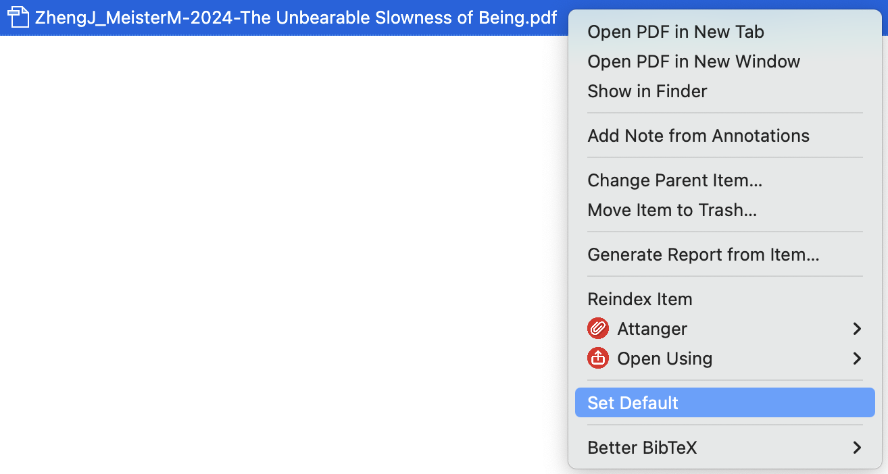

# Zotero Default Attachment

A Zotero plugin that lets you choose which PDF opens when you double-click an item with multiple attachments.

By default, Zotero always opens the first PDF that was added. This plugin adds a right-click menu option to set any PDF as the default.

## How It Works

1. Expand an item that has multiple PDF attachments
2. Right-click the PDF you want as the default
3. Click **Set Default**

To undo, right-click the same PDF and click **Unset Default**.
